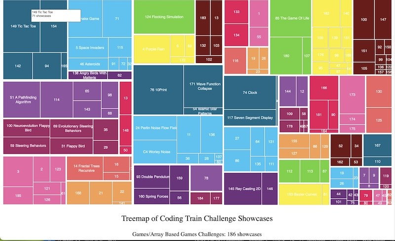

# Treemap 0f Coding Train Challenges Showcases 

A while back I found a zoomable treemap of US imports that I really liked and decided to create my own version of a zoomable treemap. A good rule of thumb is that you should start with data that you know pretty well, so I decided to start with data on the Coding Train challenge showcase counts (since I help to maintain the [Coding Train](https://github.com/CodingTrain/thecodingtrain.com) website). After a few iterations, I have come up with two versions of the treemap in p5.js using [d3js](https://d3js.org), illustrated with Coding Train challenge showcase count. The first lists all of the challenges in one view, with the challenges grouped together into major categories:

<p align="center"></p>

As you can see, there are so many challenges that quite a few of the rectangles are very small and there was only space to list the challenge number. A popup window lists the full challenge name and showcase count. You can explore the treemap [here](https://editor.p5js.org/kfahn/full/hKThc8O9o).

The second one is a zoomable treemap. Only the major categories are listed in the first view, and you click into a deeper view. You can explore the zoomable treemap [here](https://editor.p5js.org/kfahn/full/snbNKwyWW).

<p align="center"></p>

The basic principle behind a treemap is fairly simple -- visually represent the data by drawing a rectangle for each category, with the area proportional to the relative value of that category. For example, as of 10-30-24 there about 2800 challenge showcases on the website, and 90 have been submitted to 10Print. Consequently, the area for the 10Print Coding Challenge should be large relative to the size of another challenge with only a few showcases.

A naive attempt results in skinny, elongated rectangles. The squarify algorithm was developed to address this issue by improving the aspect ratio of the rectangles. I am utilizing the d3.js library, which has an option to build a treemap using the squarify algorithm. You will need to add the d3.js library in the index.html file.

```html
 <script src="https://cdn.jsdelivr.net/npm/d3@7.9.0/dist/d3.min.js"></script>
```

## Steps to Create a Squarified Treemap

### Generate or obtain a JSON file

Since there was no pre-existing JSON file with data on Coding Train challenge showcase count, I had to generate one. There are, however, many pre-existing files that you could use. If you would like more information on how to access and import a JSON file into a p5 sketch, I recommend watching Daniel Shiffman's [Working with Data and APIs in JavaScript](https://thecodingtrain.com/tracks/data-and-apis-in-javascript) tutorials.

If you want to create your own, make sure you are in the directory that you want to base the treemap on, and then run this [command](https://stackoverflow.com/questions/71669974/how-to-count-number-of-tracked-files-in-each-sub-directory-of-the-repository) in terminal.

<p align="center"></p>

```git
git ls-files | awk '{$NF="";print}' FS=/ OFS=/ | sort | uniq -c
```

The output of this command will look like something like this:

```txt
31 content/videos/challenges/100-neuroevolution-flappy-bird/showcase/
2 content/videos/challenges/101-may-the-4th-scrolling-text/
4 content/videos/challenges/101-may-the-4th-scrolling-text/showcase/
2 content/videos/challenges/102-2d-water-ripple/
1 content/videos/challenges/102-2d-water-ripple/images/
```

I copied the result of the command and pasted into a .txt file. (I named the file "10_30_24.txt" because I wanted to keep track of the date I accessed the Coding Train website files.)

I got some help from chatGPT writing the script to create the JSON file. It could probably be improved upon, but it is functional. Because I wanted to explore creating a zoomable treemap, I grouped the challenges into major categories and then divided some into sub-categories. The categorization scheme is based on my knowledge of what topics were covered in each challenge and was a bit of a judgement call, which is often the data with data analysis.

Run the `create_json.py` script in terminal, changing `input_file` (line 131) to whatever you have named the txt file. Make sure you are in the same folder as the txt file when you run the command.

```python
python create_json.py
```

The output will be a json file (`showcases.json`). It will have the following format:

```JSON
{
    "name": "root",
    "children": [
        {
            "name": "3D Rendering",
            "children": [
                {
                    "name": "112 3d rendering with rotation and projection",
                    "value": 18
                },
                {
                    "name": "113 4d hypercube aka tesseract",
                    "value": 17
                },
                {
                    "name": "87 3d knots",
                    "value": 8
                }
            ]
        },
```

### Preload the json file into your p5 sketch

```JavaScript
function preload() {
  data = loadJSON("showcases.json");
}
```

### Initialize the d3 hierarchy and treemap layout

```JavaScript
// Initialize D3 Hierarchy and Treemap Layout
  root = d3
    .hierarchy(data)
    .sum((d) => d.value)
    .sort((a, b) => b.value - a.value);

  treemapLayout = d3
    .treemap()
    .size([width, height])
    .padding(3)
    .tile(d3.treemapSquarify);
```

We are specifying the `treemapSquarify` option for the tile because this give a nicer aspect ratio for the rectangles - the default is to use the golden ratio although it is possible to choose others. (Note that while the documentation states that this is the goal, it is not guaranteed.) You can learn more about treemaps by reading "Squarified Treemaps" by Bruls, et. al.

For the first treemap version, we retrieve the leaf nodes:

```JavaScript
treemapData = root.leaves();
treemapLayout(root);
drawTreemap();
```

The d3.js [examples](https://observablehq.com/@d3/treemap/2) use a svg container, which is not something that is natively supported in p5.js. I was able to create my own version (with some help from chatGPT) using a createGraphics buffer. In drawTreemap(), we loop through the nodes of `root.leaves()`, retrieving the challenge name (node.data.name) and showcase count (node.value), and the x, y positions of the start and end of the rectangles (node.x0, node.x1, node.y0, node.y1). I am also storing the name of the parent category (node.parent), which I add in a subtitle below the treemap.

```JavaScript
graphics.push({
      buffer: buffer,
      x: x,
      y: y,
      w: w,
      h: h,
      name: node.data.name,
      value: node.value,
      parent: parentNode,
    });
```

In the zoomable treemap, I have added a variable to keep track of the currentRoot. We loop through the currentRoot.children in drawTreemap(). Whenever a rectangle is clicked, the currentRoot is updated in applyTreemapLayout().

```JavaScript
currentRoot = root;
applyTreemapLayout();
drawTreemap();
```

## Resources

- [d3-hierarchy/treemap Documentation](https://d3js.org/d3-hierarchy/treemap)
- [Growth Lab](https://atlas.cid.harvard.edu/explore?country=188&queryLevel=location&product=undefined&year=2001&productClass=HS&target=Product&partner=undefined&startYear=undefined)
- [Squarify - Javascript](https://github.com/huy-nguyen/squarify/tree/master)
- [Squarified Treemaps](https://vanwijk.win.tue.nl/stm.pdf)
- [Squarify Processing Libary](https://github.com/agatheblues/squarify)
- [Treemapping](https://en.wikipedia.org/wiki/Treemapping)
